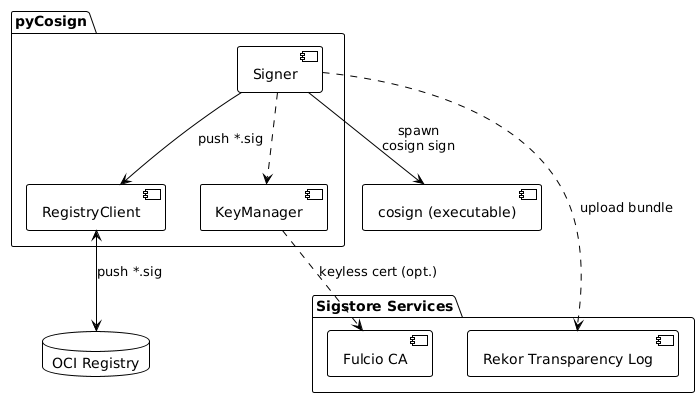
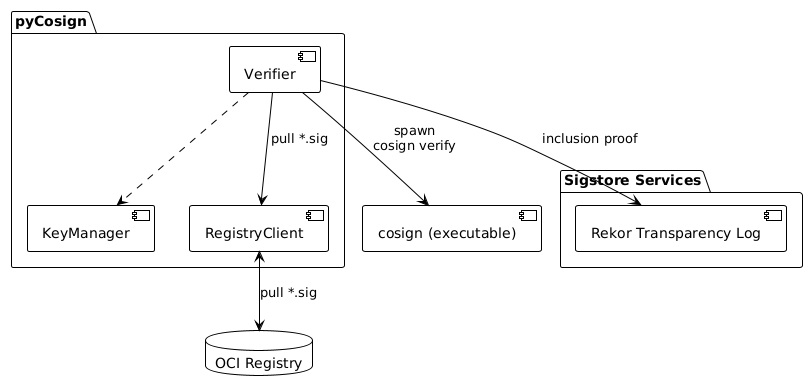
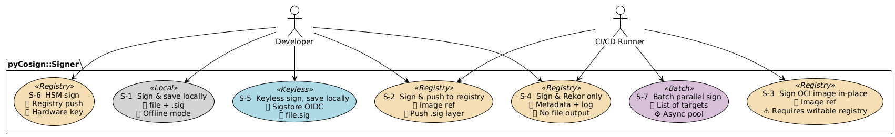
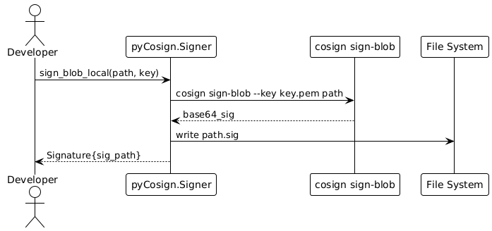
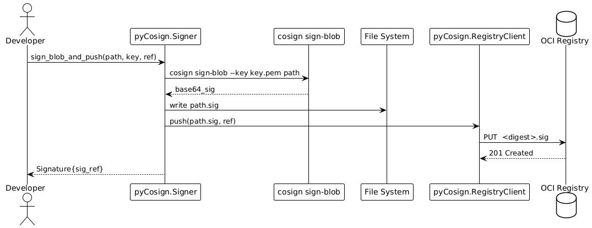
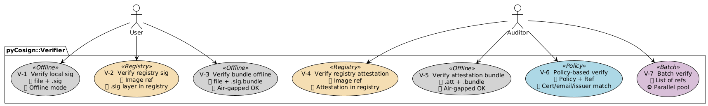
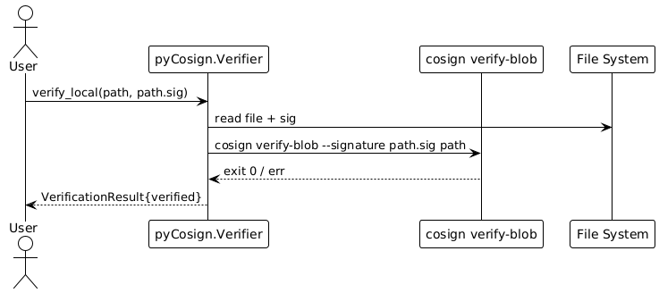
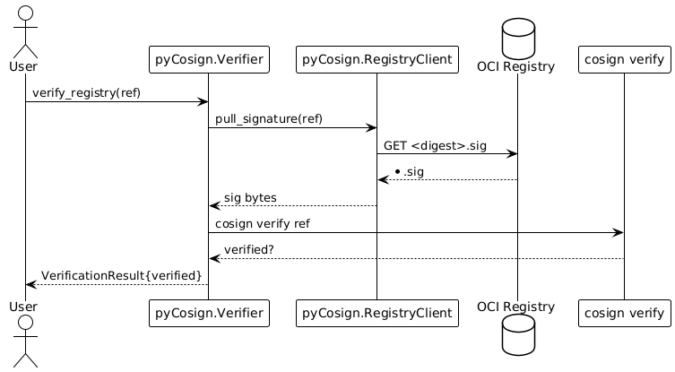

# pyCosign Design Specification  

> **Version 0.1 – June 2025**  
> This living document captures the architecture, roles, and primary use‑cases for _pyCosign_ — a Python façade around the `cosign` executable and Sigstore services.  

## Table of Contents
1. [Purpose & Scope](#purpose--scope)  
2. [Reference Architecture](#reference-architecture)  
3. [Role Overview](#role-overview)  
4. [Signer](#signer-1)  
5. [Verifier](#verifier-1)  
6. [Attester](#attester-1)  
7. [Glossary](#glossary)

## Purpose & Scope
_pyCosign_ offers a **thin, class-based wrapper** that orchestrates the trusted `cosign` CLI while hiding subprocess and storage details from application developers. The project supports:

* Detached signatures & attestations for any local file  
* OCI-native signatures/attestations for container images and other OCI artifacts  
* Rekor transparency-log integration (optional or offline bundle)  
* Multiple key sources (file, Fulcio keyless, HSM/PKCS#11)

> ⚠️ This document intentionally limits itself to the _foundational_ use-cases required in sprint 1. More advanced flows (HSM, batch, policy-verify) appear only as placeholders.

## Reference Architecture
The _pyCosign_ runtime is organized around **three orthogonal roles — Signer, Verifier, and Attester** — that share a `KeyManager` for credential handling and a `RegistryClient` for OCI I/O. Each role calls the local `cosign` executable to perform cryptographic work; the Python layer concentrates on orchestration, storage decisions (local FS / OCI registry / Rekor), and observable logging.  

### Component Views
#### Signer
The **Signer** produces tamper-evident signatures for files or OCI digests. It discovers keys (or fetches a keyless Fulcio cert), invokes `cosign sign`/`sign-blob`, and persists detached `*.sig` layers to the chosen backend—filesystem, OCI registry, and/or Rekor bundle.  

#### Verifier
The **Verifier** confirms artifact integrity by fetching signatures (local or OCI), calling `cosign verify`/`verify-blob`, applying optional policy filters (cert identity, issuer, annotations), and—if online—checking Rekor inclusion proofs. It returns a structured `VerificationResult` with verdict and log indexes.  

#### Attester
The **Attester** attaches supply-chain metadata (SPDX, CycloneDX, in-toto predicates). Given a predicate file, it calls `cosign attest`/`attest-blob` to create a signed `*.att` layer, which can be saved locally, pushed to an OCI registry, and/or bundled into Rekor for transparency.  

## Role Overview

| Role | Responsibility | Primary Public Methods |
|------|----------------|------------------------|
| **Signer** | Produce signatures for local files or OCI digests and store them per configuration (filesystem, registry, Rekor). | `sign_blob_local` · `sign_blob_and_push` · `sign_artifact` |
| **Verifier** | Validate signatures / attestations—including optional policy checks—and, when online, confirm Rekor inclusion proofs. | `verify_local` · `verify_registry` · `verify_attestation` |
| **Attester** | Attach supply-chain metadata (SPDX, CycloneDX, in-toto predicates) to artifacts and persist detached `*.att` layers. | `attest_blob_local` · `attest_blob_and_push` · `attest_artifact` |

## Signer

### Role Description
The **Signer** generates tamper-evident signatures for files or OCI digests.  
It discovers key material (file-based, keyless Fulcio cert, or HSM), spawns `cosign sign` / `sign-blob`, and stores detached `*.sig` layers according to runtime configuration—local filesystem, OCI registry, and/or a Rekor bundle.

> **Component diagram:** see §Reference Architecture → Signer.

---

### Use Cases

| UC-ID | Title | Storage Target | Key Source |
|-------|-------|----------------|------------|
| **S-1** | Sign local file & save `.sig` locally | Filesystem | Key file |
| **S-2** | Sign local file & push `.sig` to OCI registry | OCI registry | Key file |
| S-3 | Sign OCI image already in registry | OCI registry | Key file |
| S-4 | Sign local file & upload **only** Rekor bundle | Rekor | Key file |
| S-5 | Keyless sign local file & save `.sig` locally | Filesystem | Fulcio cert |
| S-6 | HSM sign local file & push `.sig` to registry | OCI registry | PKCS #11 |
| S-7 | Parallel-sign multiple artifacts (async pool) | User-selected | any |

---

### Sequence Diagrams

#### UC S-1 — Sign local file & save `.sig` locally

#### UC S-2 — Sign local file & push `.sig` to OCI registry

## Verifier

### Role Description
The **Verifier** confirms artifact integrity and authenticity.  
It retrieves detached signatures or attestations—either from the local filesystem or an OCI registry—then invokes `cosign verify` / `verify-blob` / `verify-attestation`. Optional policy filters (certificate identity, OIDC issuer, annotation key-value) and Rekor inclusion proofs can be enforced to meet stricter supply-chain requirements. Results are returned as a structured `VerificationResult` object.

> **Component diagram:** see §Reference Architecture → Verifier.

---

### Use Cases

| UC-ID | Title | Inputs | Notes |
|-------|-------|--------|-------|
| **V-1** | Verify local file with detached `.sig` | `file`, `file.sig` | Offline verification, no registry required |
| **V-2** | Verify OCI image signature in registry | Image reference | Uses registry-native `<digest>.sig` layer |
| V-3 | Verify local bundle offline (`.sig.bundle`) | `file`, `file.sig.bundle` | No Rekor connectivity needed |
| V-4 | Verify OCI attestation in registry | Image reference | `cosign verify-attestation` |
| V-5 | Verify attestation bundle offline | `.att`, `.bundle` | Works in air-gapped mode |
| V-6 | Policy-based verify (cert/email/issuer/annotations) | Artifact ref + policy | Extends V-1/2/4 |
| V-7 | Batch / parallel verify many refs | List of refs | Async pool |

---

### Sequence Diagrams

#### UC V-1 — Verify local file with detached `.sig`

#### UC V-2 — Verify OCI image signature in registry

